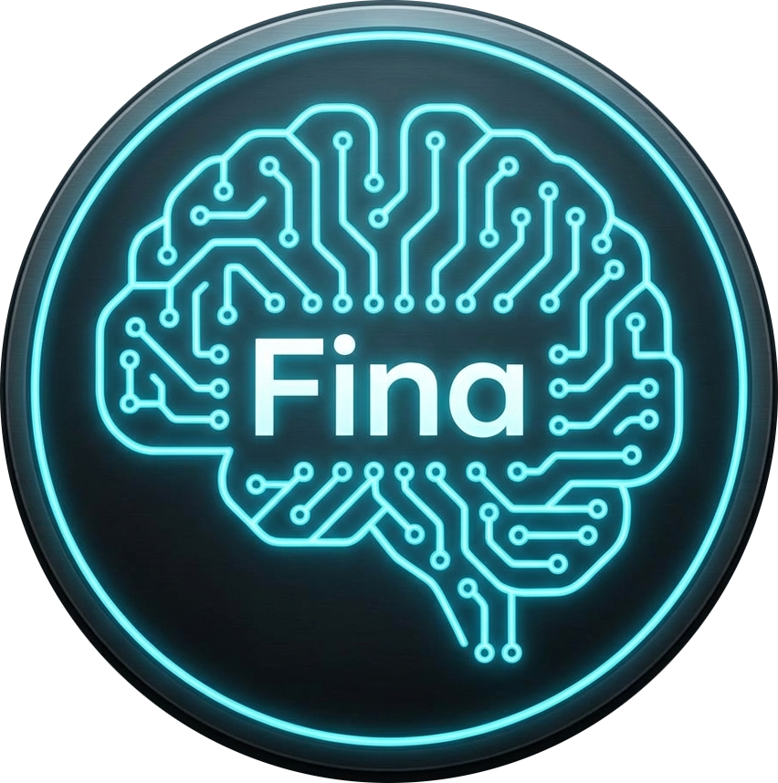

<h1 align="center">
  
  <br>Fina Ergen v3.5
</h1>

<p align="center">
  <strong>El Asistente de Voz Modular y Domótico para Linux</strong>
</p>

<p align="center">
  <a href="#-características">Características</a> •
  <a href="#️-arquitectura-modular">Arquitectura Modular</a> •
  <a href="#-instalación-rápida">Instalación Rápida</a> •
  <a href="./docs/MANUAL_DE_USUARIO_COMPLETO.md">📚 Manual Completo</a>
</p>

<p align="center">
  
</p>

---

**Fina Ergen** no es solo un script; es un cerebro avanzado que corre localmente en tu sistema Linux con una hermosa interfaz nativa de escritorio (Tauri/Vue). Diseñada para procesar lenguaje natural en español con extrema rapidez offline, Fina es capaz de todo: desde hablarte con voces hiperrealistas y autenticarte por biometría dual, hasta controlar toda la domótica de tu casa (Cámaras, Android TV, Aire Acondicionado) mediante su increíble arquitectura de plugins.

## ✨ Características Principales

- ⚡ **Súper Procesamiento de Voz:** Usa Vosk para velocidad offline relámpago y Whisper como alternativa.
- 🗣️ **Voces Naturales Infinitas (TTS):** Integración local mediante Piper (sin red) o conexión premium a ElevenLabs.
- 🔐 **Biometría Dual:** Primer sistema en Linux en cruzar huellas digitales de hardware con el reconocimiento irrefutable de la firma de tu voz (_Voice ID_ vía Resemblyzer).
- 🧠 **Cerebro Dinámico (LLM):** Soporte nativo para GPT/Mistral u otros modelos. Si la consulta supera sus acciones locales, su IA piensa la respuesta.
- 📺 **Domótica Extrema (IoT):** Fina controla tu Smart TV, decodificadores, aires acondicionados y sistemas de videovigilancia Tuya/SmartLife sin pestañear.
- 🔌 **Arquitectura 100% Modular:** Instala solo el motor base. Luego elige qué dependencias de IoT quieres integrar: tu computadora no colapsará instalando librerías que no usa.

## ⚙️ Arquitectura Modular (Fina Plugins)

Fina está dividida en un núcleo de IA liviano y una potente de capa externa comunitaria.

| Categoría   | Plugins Incorporados                      | Funciones Destacadas                                   |
| :---------- | :---------------------------------------- | :----------------------------------------------------- |
| **TV**      | `Android TV Remote`, `Chromecast`, `TCL`  | Mute, cambiar canales de decodificadores, HDMI y YouTube. |
| **Clima**   | `Midea`, `Surrey`                         | Ajuste por voz de los grados, modo ventilación y calor.|
| **Timbre**  | `Tuya Doorbell Sniper`                    | Integración con Waydroid para atender a las visitas por Fina. |
| **Sistema** | `App Management`, `Brightnes`, `Xdotool`  | Minimizar, cerrar y suspender herramientas de escritorio linux. |
| **Terceros**| `plugins/custom/`                         | Descarga automatizaciones de la comunidad sin editar el repo. |

## 🚀 Instalación Rápida

_Requisitos previos: `python 3.10+`, `rustc` y `npm/Node.js`_

1. **Clona el motor base:**
```bash
git clone https://github.com/tu-usuario/Fina-Ergen.git
cd Fina-Ergen
```

2. **Instala el núcleo (Fina Base):**
```bash
# Recomendado dentro de un entorno virtual (venv)
python3 -m venv venv
source venv/bin/activate

# Solo instala IA, reconocimiento, UI y Utils
pip install -r requirements.txt
```

3. **Inicia Fina Ergen (Modo Gráfico Completo):**
```bash
bash lanzar_fina_simple.sh
```
_(Para añadirle poderes de TV o Aire, revisa el Manual Completo e instala el `requirements.txt` de sus carpetas en `/plugins/`)_


## 📚 Documentación

Hemos reestructurado toda la información técnica para ti:

- 📖 [Manual del Usuario Completo](./docs/MANUAL_DE_USUARIO_COMPLETO.md) (Guía Definitiva)
- 🧩 [Guía de Creación de Plugins](./docs/PLUGINS_GUIDE.md)
- 🚀 [Roadmap de Desarrollo](./docs/ROADMAP.md)

## 💖 Apoya el Proyecto

Si Fina Ergen te ha sido útil y quieres apoyar su continuo desarrollo, puedes invitarme un café o realizar una donación. ¡Toda ayuda es bienvenida para seguir mejorando el "hierro inteligente"!

| Plataforma | Link |
| :--- | :--- |
| **☕ Buy Me a Coffee** | [](https://www.buymeacoffee.com/dankopetro) |
| **🅿️ PayPal** | [](https://paypal.me/dankopetro) |
| **₿ Bitcoin** | `bc1qa75vqz7q7kac0mdf8tzsd4gxpnljh5cukvt2ll` |

---

## 🏆 Agradecimientos
El desarrollo de Fina comenzó como un _fork_ espiritual fuertemente inspirado en el código fuente del proyecto open-source [**Jarvis Voice Assistant**](https://github.com/KhagendraN/Jarvis-Voice-Assistant) creado por [@KhagendraN](https://github.com/KhagendraN) bajo licencia MIT. A partir de esos divertidos scripts iniciales de automatización, Fina evolucionó con los años hacia esta inmensa arquitectura modular. Fina no existiría hoy con esta arquitectura de no ser por esos primeros cimientos.

---
<p align="center">
  <b>Hecho con ❤️ en Argentina. Licencia MIT.</b> <br>
  <i>"El hierro inteligente."</i>
</p>