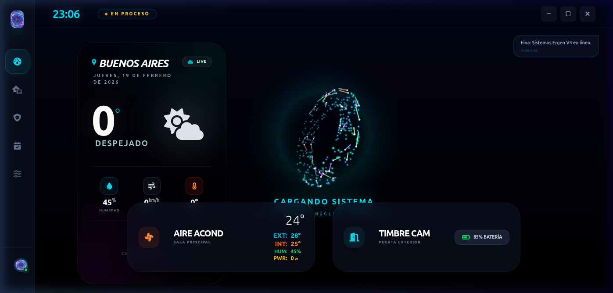

# 📖 Manual de Usuario Completo: Fina Ergen v3.5

Bienvenido a la guía definitiva de Fina Ergen. Fina comenzó como un experimento por terminal y ha evolucionado a ser una súper IA híbrida (Offline/Online) capaz de auditar tu casa entera. Al estar diseñada para Linux e integrarse nativamente con motores de Rust, se convierte en el Asistente Digital de más bajo consumo de RAM posible, pero con altísimo rendimiento.

## 1. Conociendo a Fina
**Fina "Ergen"** (que engloba toda la UI moderna interactiva) es una asistente virtual proactiva. A diferencia de un simple parser de comandos programados, Fina es un software cognitivo:
- **Escucha Biológica:** El umbral de micrófono (`ENERGY_THRESHOLD`) detecta el ruido blanco y reacciona solo a la intención de habla humana.
- **Biometría de Segunda Capa:** Fina no obedece a cualquiera. Usando `Resemblyzer`, extrae el *tensor* o mapa 3D de tu garganta y audita que quien acaba de decir una orden fuere verdaderamente el Administrador. También integra un lector USB de huella dactilar.
- **Inteligencia Universal:** Si la pregunta sale de su catálogo de habilidades locales (Por ej: "Fina, redactame una carta formal para mi jefe de sistemas"), la arquitectura intercepta la falla (*Intent No Encontrado*) y dispara el Cerebro de Nube (Conexión LLM) para resolver el problema conversando como una persona.

---

## 2. Configuración y Claves (Cerebro IA)

Para editar la forma en que Fina hace su magia sin tocar una sola de sus más de 50.000 líneas de código, tienes dos opciones:

1. Modificando el archivo general **`fina_settings.json`** en la carpeta principal.
2. Abriendo el Panel de Ajustes interactivo de Ergen en el ícono de la tuerca.

### APIs Requeridas para Uso Extendido
Si vas a correr la versión de terminal/offline, no necesitas nada de esto. Si requieres poderes de Next-Gen:
*   **GITHUB_TOKEN / OPENAI_API_KEY**: Indispensable para que Fina deje de ser robot y ponga a trabajar modelos como OpenAi o Codestral-2501 vía GitHub Models. Te contestará con inteligencia enciclopédica.
*   **ELEVENLABS_API_KEY**: Esta API convierte a Fina en una actriz de doblaje de estudio. La calidad de voz es extremadamente realista, respeta tus tildes, comas y entonaciones dramáticas.

> **ℹ️ Consejo de la Comunidad:** Fina incluye el motor de texto a voz **Piper**, un pequeño milagro open-source. Piper puede brindarte voces acento "Argentino" de gran naturalidad sin tocar el internet y a `0 ms` de velocidad en procesamiento neuronal. Actívalo borrando la clave de ElevenLabs.

---

## 3. Comandos de Voz Base (Offline)

Fina utiliza el registro `intents.json` que contiene redes neuronales de palabras. Esto significa que **NO** necesitas decirle las palabras exactas, pero si algo parecido. El clasificador vectorial entenderá tu intención matemática.

**Control del Entorno Linux:**
- 🗣️ *"Fina, subí el brillo al máximo por favor"*
- 🗣️ *"Fina, ¿Podrías cerrar esta aplicación?"*
- 🗣️ *"Fina, minimiza la ventana"* o *"Apagar el entorno de trabajo"*
- 🗣️ *"Ponele pausa a la música", "Canción siguiente"*

**Gestión de Consultas Rápidas:**
- 🗣️ *"Fina, buscadme un chiste de programadores"* (Random module)
- 🗣️ *"Traeme noticias de tecnología"* (Busca en NewsAPI de Argentina)
- 🗣️ *"Decime cuál es el clima de hoy"* (Consultando el Forecast Global)

---

## 4. Domótica Total (IoT) y Módulos Externos

Fina **NO** instala cosas que no vas a usar. Por ello hemos aislado la domótica.
Para encender los "Plugins de tu Casa", debes entrar a `plugins/su_directorio/` e instalar sus requisitos mediante su archivo de requerimientos, por ej: `pip install -r requirements.txt`.

### Plugin de Climatización (`plugins/clima/`)
Usa la red MSMART o Midea.
- 🗣️ *"Fina, prendé el aire, por favor"*
- 🗣️ *"Fina, hace calor, clavá el aire en veintidós grados"*
- 🗣️ *"Fina, poneme el ventilador en turbo"*

> **Si no tienes instaladas sus dependencias**, Fina interceptará tu fallo y por voz te avisará que te falta la librería Python de tu aire en vez de romper la consola.

### Plugin de Decodificador y TV (`plugins/tv/`)
Usando puentes como ADB AndroidTV o ChromeCast.
- 🗣️ *"Fina, encendé la tele del living"*
- 🗣️ *"Fina, poné youtube en rojo"* (O la app que necesites)
- 🗣️ *"Calla la televisión"* (Mute directo a tu SmartTV)
- 🗣️ *"Pone el canal trece en el deco"*

### Plugin del Timbre Exterior (Tuya IoT Security)
Si sincronizas un portero Tuya Smart a Fina, ella vigilará los paquetes TCP que entren por tu IP local.
*   **1. Dinámica:** Cuando alguien toque el botón de tu casa, los interceptores de Fina activan la ventana flotante en tu monitor.
*   **2. Video y Sonido:** Se encenderá una instancia virtualizada de Weston (Waydroid) proyectando a tu visitante directamente en pantalla y usando tu micrófono de escritorio para que le hables sin soltar las manos del teclado.
*   **3. Colgado Automático:** A los `20 segundos` del streaming, se cortará automáticamente para seguir limpiando memoria y dejarte la RAM libre para trabajar.

---

## 5. Solución de Fallas Comunes (Issues)

**1. Fina se activa sola sin que yo la llame o escucha mucho.**  
Ve a tu archivo de configuraciones y ajusta el `ENERGY_THRESHOLD` (por defecto en `1600`). Si está muy bajo (ej. `300`), Fina intentará traducir hasta el chasquido del mouse. Ponlo en `3000` si tu habitación es ruidosa.

**2. Me da un error de "ALSA" o "No audio source".**  
Fina es exquisita con los micrófonos. Asegúrate de ejecutar `python3 -m sounddevice` en tu terminal, anotar el ID (ej `1`) del micrófono que uses y poner ese número en el DeviceID de tus Settings generales.

**3. "No tienes instaladas las dependencias para este módulo" (TV, Timbre, Aire)**  
Fina te acaba de advertir que su estructura de módulos está a salvo. Ingresa a la carpeta del dispositivo que intentaste llamar con tu voz (`plugins/clima`) e instala su archivo `requirements.txt` en tu entorno virtual.

---
## 🏆 Reconocimiento de Orígenes (Jarvis)
El corazón de Fina (su núcleo de escucha y text-to-speech) fue fuertemente inspirado por el proyecto original de investigación [**Jarvis Voice Assistant**](https://github.com/KhagendraN/Jarvis-Voice-Assistant) creado por [@KhagendraN](https://github.com/KhagendraN) y otros geniales proyectos open-source creados por desarrolladores de Python. A partir de esos divertidos scripts iniciales de automatización, Fina evolucionó con los años hacia la inmensa arquitectura modular en Rust y domótica IoT en la que se ha convertido hoy.
¡Gracias inmensas a KhagendraN y la comunidad por encender la mecha de esta aventura!

---
_Para construir un plugin propio de terceros, guíate con nuestra documentación [PLUGINS_GUIDE.md](./PLUGINS_GUIDE.md)._
